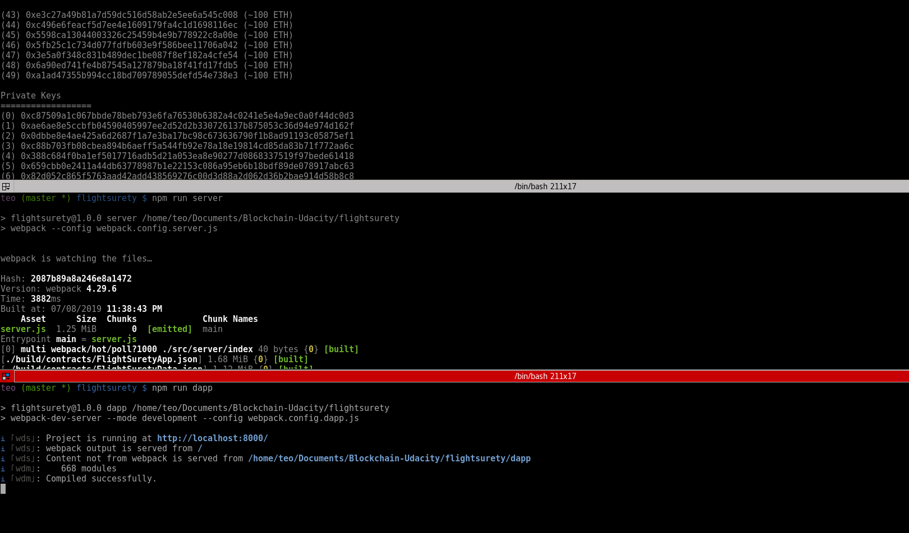
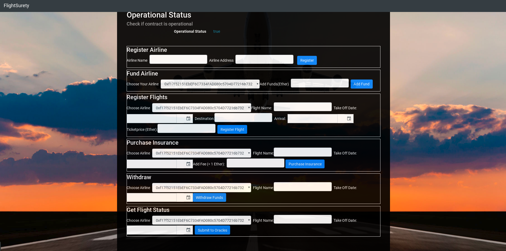
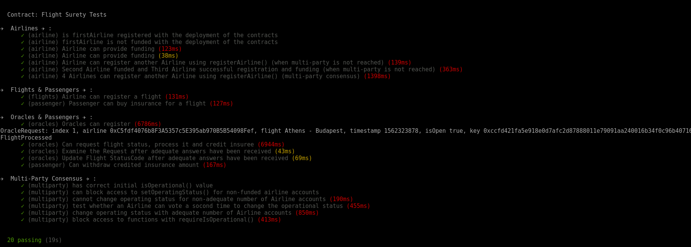

# Ethereum FlightSurety Dapp

This repository contains an Ethereum DApp with smart contracts demonstrating the potential of utilizing the Ethereum bockchain in order to automatically compensate the passengers of a flight in the event of an unexpected delay  of cancellation.

 - The First airline is registered when the Dapp is deployed. The existing airline registers the others.

 - Once the count of airlines pass beyond the number of 4 then a multi-party consensus of 50% of registered airlines is followed in order to add any new airline.

- Airline can be registered, but does not participate in contract until it submits funding of 10 ether.

- Passengers may pay up to 1 ether for purchasing flight insurance.

- If flight is delayed, passenger receives credit of 1.5X the amount they paid for insurance.

- Insurance payouts are not sent directly to passenger’s wallet but they are credited to the passengers and they can withdraw it upon request.

Oracle functionality is implemented in the server app. Upon startup, 20+ oracles are registered and their assigned indexes are persisted in memory. Update flight status requests from client Dapp result in OracleRequest event emitted by Smart Contracts that is captured by server app. Server will loop through all registered oracles, identify the oracles with matching indexes for which the OracleRequest event applies, and respond by calling into FlightSuretyApp contract with random status code of Unknown (0), On Time (10) or Late Airline (20), Late Weather (30), Late Technical (40), or Late Other (50)

The DApp User Interface:

## Testing

Sequence of Steps to Test the dapp:

1. Fund the First Airline.
2. Register Other Airlines. (as first airline)
3. Register Flights. (as airline)
4. Purchase Insurance. (as passenger)
4. Get Flight Status. (as passenger) -> (If status results to delayed flight then proceed).
5. Withdraw Funds

This repository contains Smart Contracts code in Solidity , tests , dApp scaffolding (using HTML, CSS and JS) and server app scaffolding (using Javascript).

Download the repo, and follow the bellow steps in order to test it:

`npm install`

1. Initiate a locl blockchain with Ganache with the following command, generating 50 accounts that will be used for oracles, passengers and airlines.

`ganache-cli -m "candy maple cake sugar pudding cream honey rich smooth crumble sweet treat" -l 20000000000 -a 50`

2. Then compile and migrate with truffle.

`truffle compile && truffle migrate`

3. Run the backend system simulating the oracles:

`npm run server`

4. Run the dApp:

`npm run dapp`

5. Interact with the dApp:

`http://localhost:8000`

### Testing the Smart Contracts
In order to test the Smart contracts:

`truffle test ./test/flightSurety.js`

## Built With

* [Ethereum](https://www.ethereum.org/) - Ethereum is a decentralized platform that runs smart contracts
* [Solidity](https://solidity.readthedocs.io/en/v0.5.3/) - Solidity is an object-oriented, high-level language for implementing smart contracts. Smart contracts are programs which govern the behaviour of accounts within the Ethereum state.

* [Web3Js Reference](https://github.com/ethereum/wiki/wiki/JavaScript-API)
* [Truffle Framework](http://truffleframework.com/) - Truffle is the most popular development framework for Ethereum with a mission to make your life a whole lot easier.
* [Ganache Local Blockchain](http://truffleframework.com/ganache/)
* [Remix Solidity IDE](https://remix.ethereum.org/)
